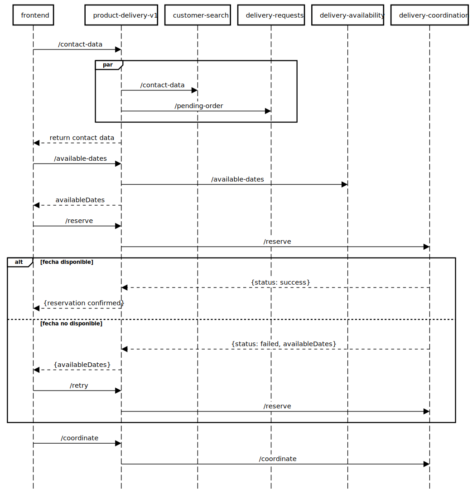

# 📌 Resumen
`<autor>`: Miguel Rodrigo Armas Abt  

---

[⚙️ GraalVM - Guía de instalación](https://github.com/miguel-armas-abt/roadmap-graalvm/blob/main/path/00-setup/README.md)  

---

## 📦 [mock-service-v1](mock-service-v1/README.md)
Simula APIs RESTful para los siguientes casos de uso:
- Consulta de datos de contacto (dirección del cliente, teléfono, email). `customer-search`
- Consulta de productos pendientes para delivery. `delivery-requests`
- Consulta de horarios disponibles para delivery. `delivery-availability`
- Reserva o registro de capacidad para el delivery. `delivery-coordination`

## 📦 [product-delivery-v1](product-delivery-v1/README.md)
- Orquesta las APIs, asegurando un orden coherente en cada una de las peticiones.
- La solución aplica state pattern.

 

